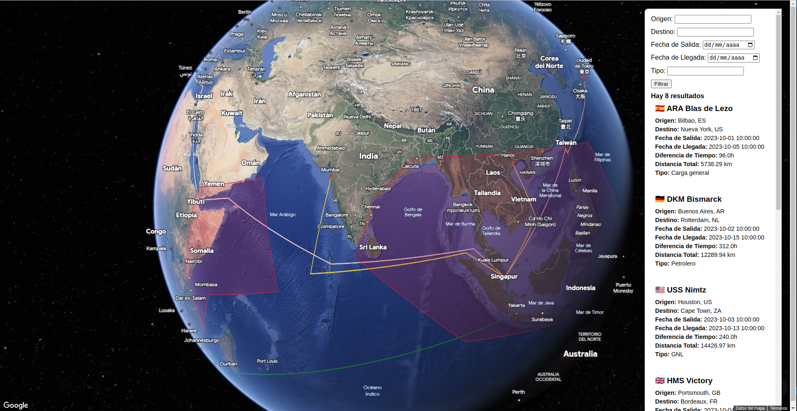

Google Maps JavaScript
======
Representación de rutas marinas en Google maps.

index.html
------
Esa página sirve sólo como experimento para subir rutas desde un archivo externo y no tenerlas hardcodeadas.

mapa.html
------
La vista del mapa, con sus dibujos y un filtro. Si se hace click en una ruta, o del menú, las otras rutas perderán color para poder ver la seleccionada mejor.

JSON
------
En este archivo he preparado una serie de rutas para representar en el mapa. Cuentan con diferentes tipos de barco, fechas de inicio y llegada diferentes, así como país de origen y de destino, para poder ser filtradas.

Los filtros
------
La vista del mapa cuenta con filtros para mostar sólo las rutas que los cumplan. Vacias y enviar para volver a ver todas.

2d
------
En la carpeta 2d está la representación clásica de un mapa plano. En ese mapa también he pintado las zonas Punta Lucero (G. Líquidos) y Punta Sollana (G. Sólidos).

3d
------
He experimentado un poco con las funciones experimentales de usar un globo en vez de mapa. En este mapa he pintado las zonas de piratería (Sudeste Asiátoco, este y oeste de África, y la zona central de América).

Capturas
------
